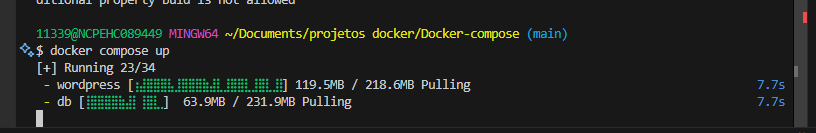

- Verificar se o docker-compose está instalado na máquina:
 ```bash 
docker-compose -v
 ```

- Caso não tenha, vá no site do hub e baixe a instalação do Docker Compose.

- Acesse o Docker Hub e procure pelo WordPress:

[WordPress](https://hub.docker.com/_/wordpress)

- Copie a instrução para o `docker-compose`.

- Execute o comando:
 ```bash
 docker-compose up -d
 ```



- Encerrar com o comando:

```bash
docker-compose down -d
```

- Desalocar os recursos:

```bash
docker-compose down -v